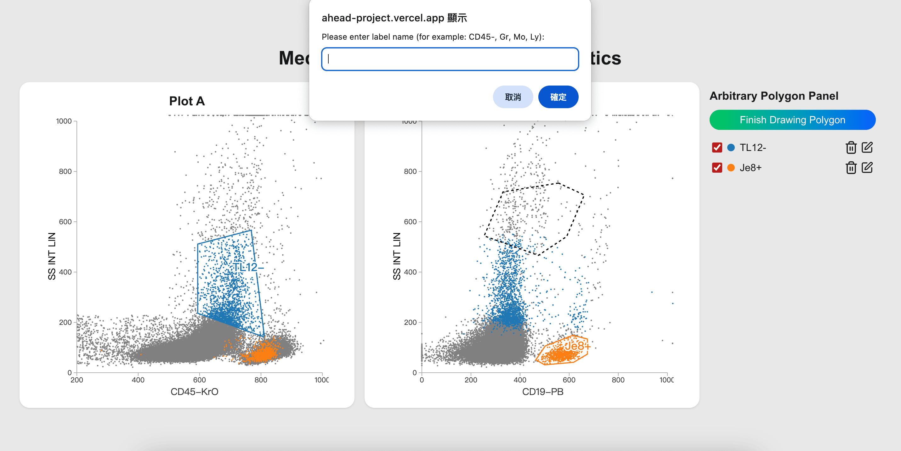

# AHEAD - 醫療數據分析專案

這是一個基於 **Next.js** 的互動式醫療細胞數據視覺化應用，支援任意多邊形選取、雙視圖對照與圖例標註。設計目的是幫助研究人員和醫師更直觀地分析細胞散佈資料。

---

## 使用技術

- [Next.js](https://nextjs.org/) - React框架
- [TypeScript](https://www.typescriptlang.org/) - 型別安全
- [Tailwind CSS](https://tailwindcss.com/) - 樣式設計
- [D3.js](https://d3js.org/) - 資料視覺化
- [PapaParse](https://www.papaparse.com/) - CSV資料讀取
- [Docker](https://www.docker.com/) - 容器化部署

---

## 安裝與啟動方式

### clone儲存庫
```bash
git clone https://github.com/weiowo/ahead-project.git
cd  ahead-project
```

### 本機啟動

```bash
# 安裝依賴
npm install

# 啟動開發伺服器
npm run dev

# 瀏覽器打開 http://localhost:3000
```

### 使用 Docker 啟動

```bash
# 建立 image
docker build -t medical-visualization .

# 執行 container
docker run -p 3000:3000 medical-visualization
```

---

## 功能說明

1.  **CSV 數據讀取：** 讀取 `CD45_pos.csv` 檔案，獲取 'CD45-KrO'、'SS INT LIN' 和 'CD19-PB' 等欄位。
2.  **視覺化數據：** 顯示兩個散佈圖，圖表 A（CD45-KrO vs. SS INT LIN）和圖表 B（CD19-PB vs. SS INT LIN）。
3.  **定義細胞群體：**
    - 點擊 **"Arbitrary Polygon"** 按鈕以開啟/關閉繪圖模式。
      
    - 點擊圖表以開始繪製多邊形。
      
    - 若要關閉多邊形，請點擊起點的位置。將出現一個提示，要求輸入群組標籤名稱。
      
    - 輸入群組名稱（例如 "CD45-", "Gr"、"Mo"、"Ly"），若未輸入則使用預設值。
      
4.  **切換各群組可視性：** 點擊圖表下方的彩色標籤按鈕以切換所選細胞群體的可視性。
    

---

## 📁 專案結構

```
app
 ┣ components       # Reusable UI 元件（如 Plot）
 ┣ hooks            # 自訂 hook（資料抓取、多邊形邏輯）
 ┣ types            # TypeScript 型別定義
 ┣ page.tsx         # 主視覺頁面
public/CD45_pos.csv # 原始數據
Dockerfile
README.md
```
